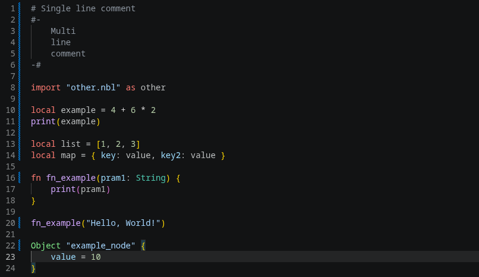

# nbcl-highlighting

[Nbcl](https://nbcl-lang.github.io/) is a simple, lightweight configuration language with native rust integration support, that provides an easy and safe way to configure with scripting support in any application.

## Features

- Syntax highlighting

## Screenshot

